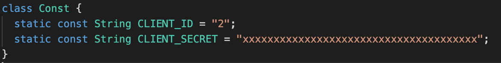
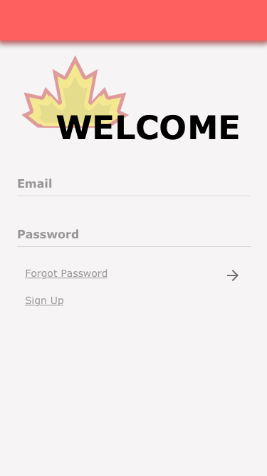
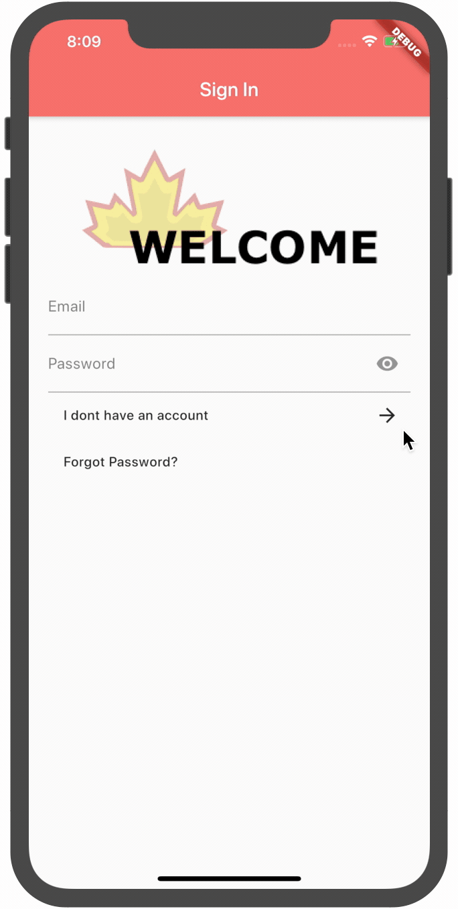
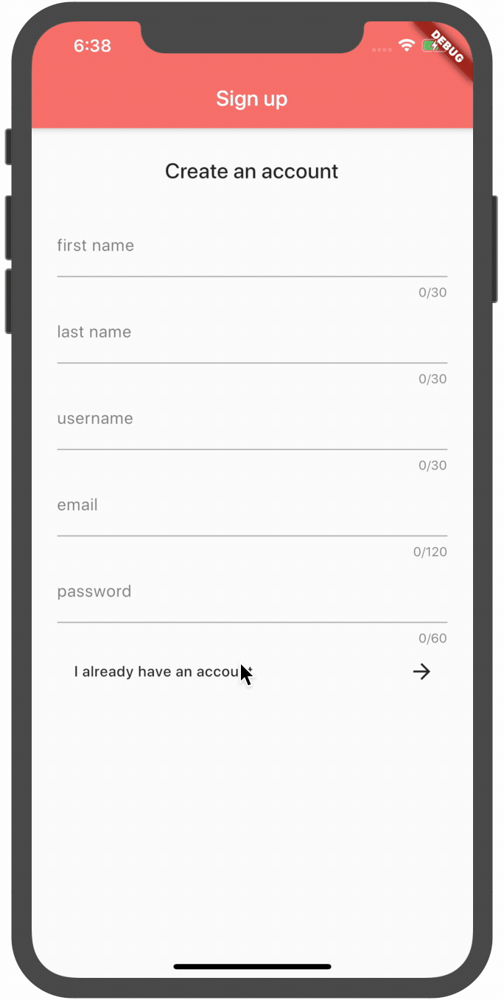
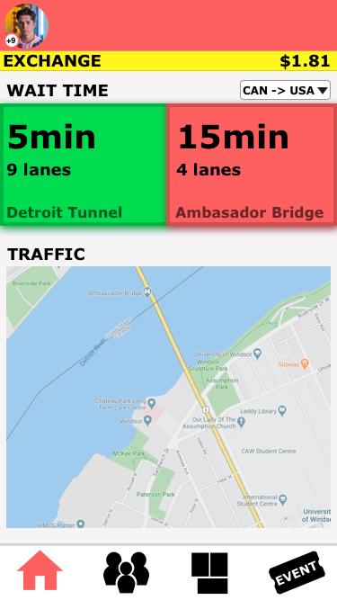
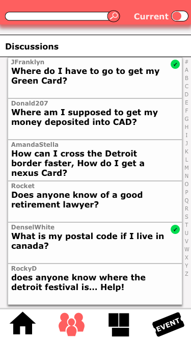
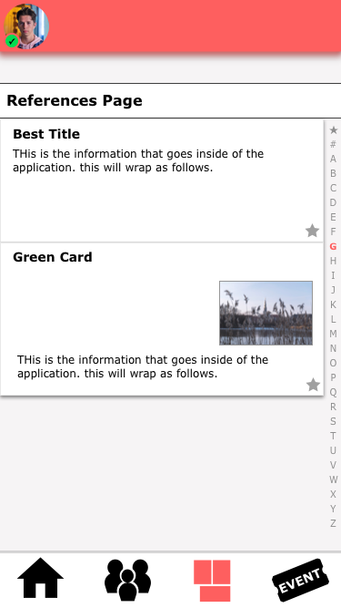
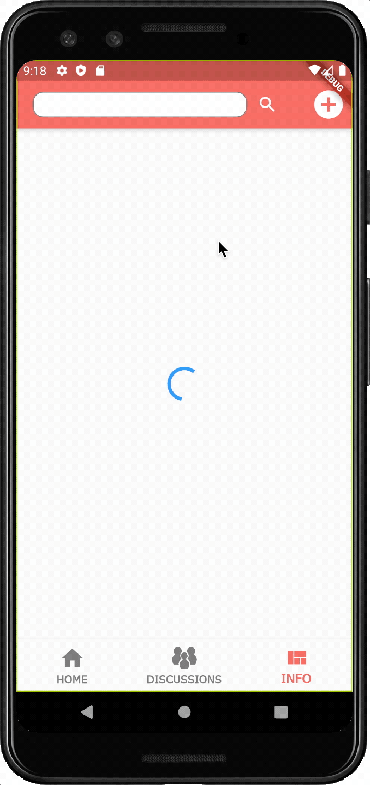

# MAPLE CROSSING
A Flutter application that allows cross border workers to see important information before crossing the border. This can include the Exchange rate, Border Wait time, or Traffic.

| Device | Working |
| :---   | :---: |
| ANDROID| 🟢|
| IOS    | 🟢|

## Prerequisite

add a Const.dart page with the constants as follows:

## User registration

-----
### Sign in
<strong>▸ starting page</strong> 
on entering the application, if you have not entered the application before, you will be brought to the applications <strong>[SignIn]</strong> page. if the user needs to create an account, they can click on the "Create an account" button to enter the <strong>[SignUp]</strong> page.

&emsp;

### Sign up

&emsp;

## Home Page
<strong>▸ starting page</strong> 
on entering the application, they will either be sent to <strong>[SignIn]</strong> or <strong>[HomePage]</strong>. If the user has previously entered the application, then it is understandable that the user has already logged into the application, and will be sent into the <strong>[HomePage]</strong>

-----
&emsp;

## Discussion Page

on entering the discussion page, a list of discussion items will be displayed. you are able to enter into the discussion with a single tap. within the <strong>[DiscussionContentPage]</strong>, the user can create a new comment onto the page. the user also has the ability to sort the discussions using the searchbar at the top.

-----
&emsp;

## Information Resource Page

on entering the information resources page, you are able to post a new information resource, or by being able to read any current resources. if you pull each resource item to the left, you'd reveal the edit & delete buttons. this will allow you to remove the item from the application.

-----
&emsp;

